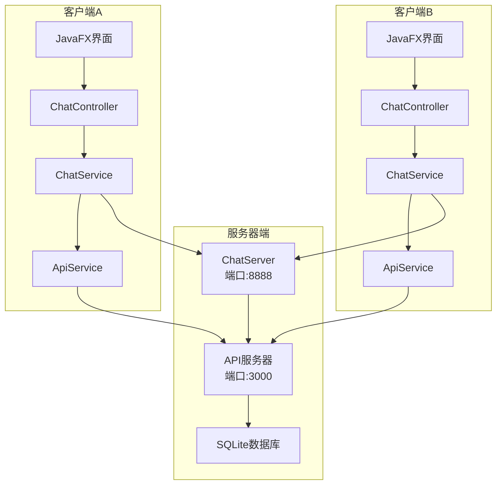
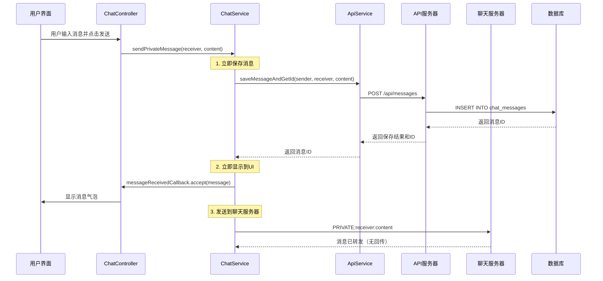
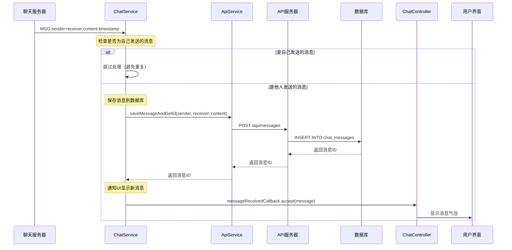
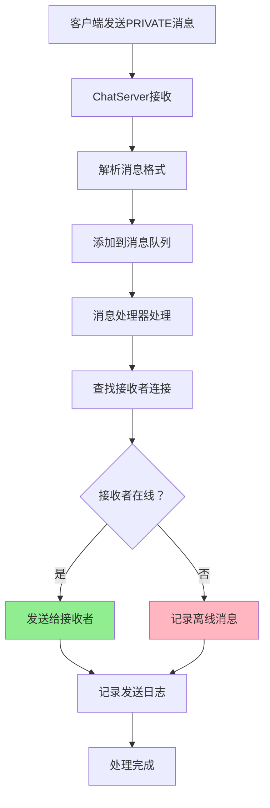
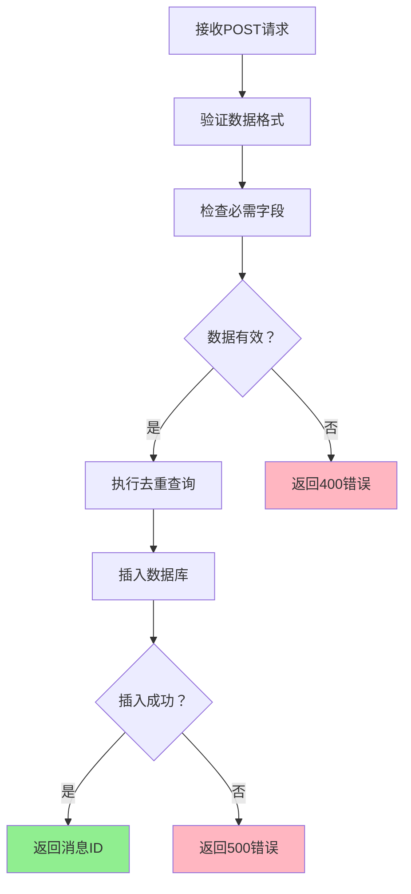
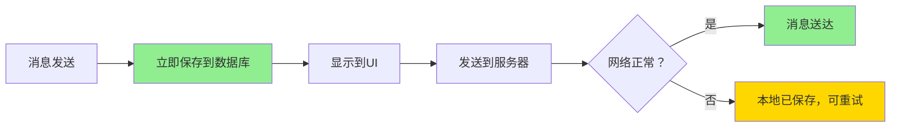
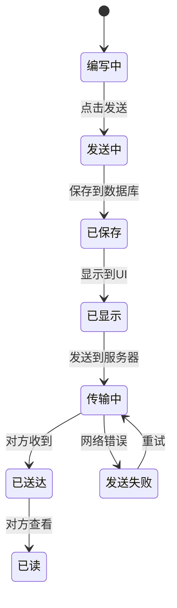
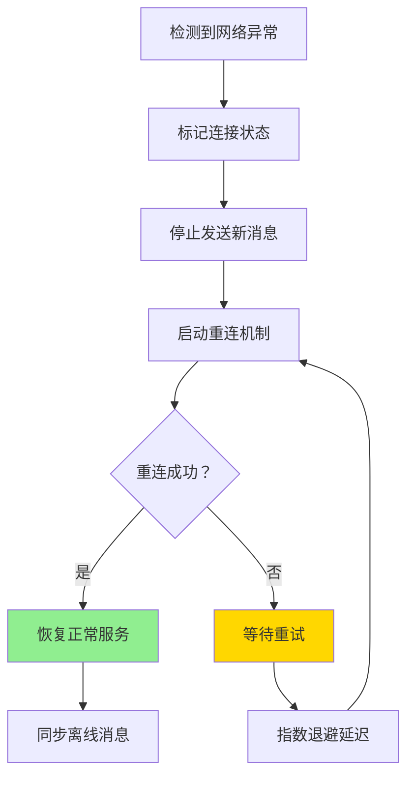

# 聊天应用消息收发机制文档

## 📖 概述

本文档详细描述了聊天应用的消息收发机制，包括客户端、服务器端的交互流程，以及数据存储和同步策略。

## 🏗️ 系统架构



## 🔄 消息发送流程

### 发送方流程图



### 接收方流程图



## 🏪 服务器端处理机制

### ChatServer消息处理流程



### API服务器数据处理



## 📊 数据存储结构

### 数据库表结构

```sql
CREATE TABLE chat_messages (
    id INTEGER PRIMARY KEY AUTOINCREMENT,  -- 消息唯一ID
    sender TEXT NOT NULL,                  -- 发送者用户名
    receiver TEXT NOT NULL,                -- 接收者用户名
    content TEXT NOT NULL,                 -- 消息内容
    timestamp TEXT NOT NULL               -- 时间戳
);

-- 创建索引优化查询性能
CREATE INDEX idx_chat_users ON chat_messages(sender, receiver);
CREATE INDEX idx_chat_timestamp ON chat_messages(timestamp);
```

### 消息去重机制

API服务器在查询时自动去重：

```sql
-- 获取两用户间消息（去重）
SELECT * FROM (
  SELECT *, ROW_NUMBER() OVER (
    PARTITION BY sender, receiver, content, timestamp 
    ORDER BY id ASC
  ) as rn
  FROM chat_messages 
  WHERE (sender = ? AND receiver = ?) OR (sender = ? AND receiver = ?)
) WHERE rn = 1
ORDER BY timestamp ASC
```

## 🔧 关键技术特性

### 1. 防重复机制

**客户端层面**：
- 发送方立即保存消息，不等待服务器回传
- 接收到自己消息的回显时直接跳过处理

**服务器层面**：
- ChatServer不再向发送者回传消息
- API查询时自动去重，避免显示重复记录

### 2. 消息可靠性



### 3. 实时同步

- **心跳检测**：每30秒发送心跳，维持连接
- **自动重连**：连接断开时自动尝试重连
- **消息队列**：服务器使用异步消息队列处理，避免阻塞

### 4. 性能优化

**客户端优化**：
- 消息ID去重，避免UI重复显示
- 异步消息处理，不阻塞UI线程
- 连接池复用，减少资源开销

**服务器端优化**：
- 线程池处理客户端连接
- 消息队列异步处理
- 数据库连接复用

## 📈 消息状态流转



## 🛠️ 故障处理机制

### 网络异常处理



### 数据一致性保障

1. **消息ID唯一性**：使用数据库自增ID确保唯一
2. **时间戳统一**：客户端和服务器时间戳保持一致
3. **事务处理**：关键操作使用数据库事务
4. **定期清理**：提供重复数据清理工具

## 📝 配置参数

### 客户端配置

```java
// 服务器连接配置
private static final String SERVER_HOST = "8.134.99.69";
private static final int SERVER_PORT = 8888;
private static final String API_BASE_URL = "http://8.134.99.69:3000/api";

// 超时配置
private static final int CONNECT_TIMEOUT = 5000;  // 连接超时5秒
private static final int READ_TIMEOUT = 30000;    // 读取超时30秒

// 重试配置
private static final int MAX_RETRIES = 3;         // 最大重试3次
```

### 服务器配置

```java
// 端口配置
private static final int PORT = 8888;            // 聊天服务器端口
private static final int API_PORT = 3000;        // API服务器端口

// 线程池配置
private static final ExecutorService threadPool = Executors.newCachedThreadPool();
private static final ExecutorService messagePool = Executors.newFixedThreadPool(10);

// 心跳配置
private static final long HEARTBEAT_INTERVAL = 30000;  // 30秒心跳间隔
```

## 🎯 总结

本聊天应用采用了客户端-服务器架构，通过以下机制确保消息的可靠传输：

1. **双重保障**：本地立即保存 + 服务器转发
2. **防重复**：多层去重机制，确保数据唯一性
3. **高可用**：心跳检测、自动重连、异常处理
4. **高性能**：异步处理、连接复用、消息队列

该设计既保证了消息的实时性，又确保了数据的完整性和一致性，为用户提供了稳定可靠的聊天体验。

---

*文档版本：v1.0*  
*最后更新：2025年9月19日*
